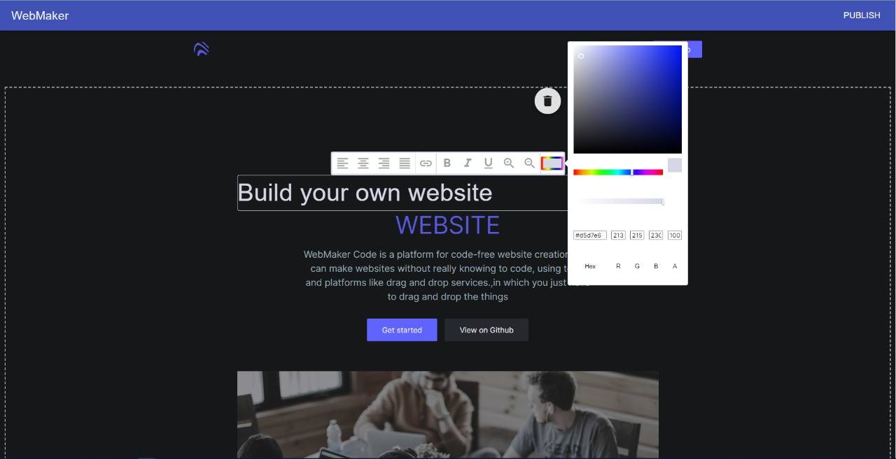
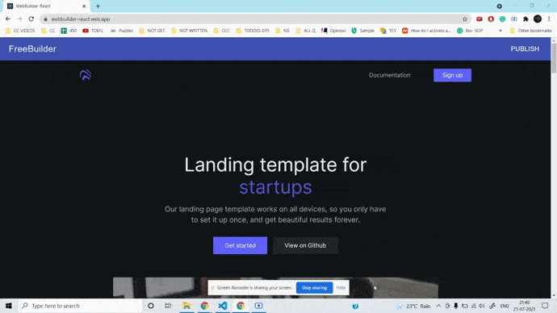

# WebMaker

<br>

<p align="center">
    
</p>

A website should be the easy part of building a business. So here is the Frere Web Building tool. Just change text, images and style them as you need. You can drag and drop the components you need, which are inbuilt

<br/>

### Live Demo - [Chusespo](https://webbuilder-react.web.app)

---

### Table of Contents

- [Demo](#demo)
- [Project Layout](#project-layout)
- [References](#references)
- [Author Info](#author-info)

---

## Demo

### Change Text and Images
<br>
<p align="center">
    
</p>

<br>

### Add or Delete Pre-built Components

<br/>
<p align="center">
    
</p>


#### [Back To The Top](#WebMaker)

---

## Project Layout
<br />

```
Website-Builder-React
├─ firebase.json
├─ package-lock.json
├─ package.json
├─ public
│  ├─ favicon.ico
│  ├─ index.html
│  ├─ logo192.png
│  ├─ logo512.png
│  ├─ manifest.json
│  └─ robots.txt
├─ README.md
└─ src
   ├─ App.css
   ├─ App.js
   ├─ App.test.js
   ├─ components
   │  ├─ AddElement.js
   │  ├─ DisplayElements.js
   │  ├─ EditableText.js
   │  ├─ elements
   │  │  ├─ Button.js
   │  │  ├─ ButtonGroup.js
   │  │  ├─ Checkbox.js
   │  │  ├─ FormHint.js
   │  │  ├─ FormLabel.js
   │  │  ├─ Image.js
   │  │  ├─ Input.js
   │  │  ├─ Modal.js
   │  │  ├─ Radio.js
   │  │  ├─ Select.js
   │  │  ├─ SmoothScroll.js
   │  │  └─ Switch.js
   │  ├─ ImageEdit
   │  │  ├─ EditImage.js
   │  │  └─ firebase.js
   │  ├─ layout
   │  │  ├─ Footer.js
   │  │  ├─ Header.js
   │  │  └─ partials
   │  │     ├─ FooterNav.js
   │  │     ├─ FooterSocial.js
   │  │     └─ Logo.js
   │  ├─ NewElements.js
   │  └─ sections
   │     ├─ Accordion.js
   │     ├─ Carousel.js
   │     ├─ ChatBox.js
   │     ├─ Cta.js
   │     ├─ ExpandableTable.js
   │     ├─ FeaturesSplit.js
   │     ├─ FeaturesTiles.js
   │     ├─ GenericSection.js
   │     ├─ Hero.js
   │     ├─ partials
   │     │  └─ SectionHeader.js
   │     ├─ PlaceOrder
   │     │  ├─ Address.js
   │     │  ├─ Checkout.js
   │     │  ├─ PaymentForm.js
   │     │  └─ Review.js
   │     ├─ PricingTemplate.js
   │     ├─ ReviewCard.js
   │     ├─ SigninElement.js
   │     ├─ Testimonial.js
   │     ├─ ThreeImages.js
   │     ├─ Timeline.js
   │     ├─ TopNav.js
   │     └─ VerticalStepper.js
   ├─ EditContext.js
   ├─ index.js
   ├─ layouts
   │  └─ LayoutDefault.js
   ├─ serviceWorker.js
   ├─ utils
   │  ├─ AppRoute.js
   │  ├─ ScrollReveal.js
   │  └─ SectionProps.js
   └─ views
      └─ Home.js

```

---

## References

- [React JS](https://reactjs.org/)
- [Firebase](https://firebase.google.com/)

---

## Author Info

- LinkedIn - [Srinivas K](https://www.linkedin.com/in/srinivas-konduri/)
- Github - [Srinivas K](https://github.com/srinivaskool)

#### [Back To The Top](#WebMaker)


